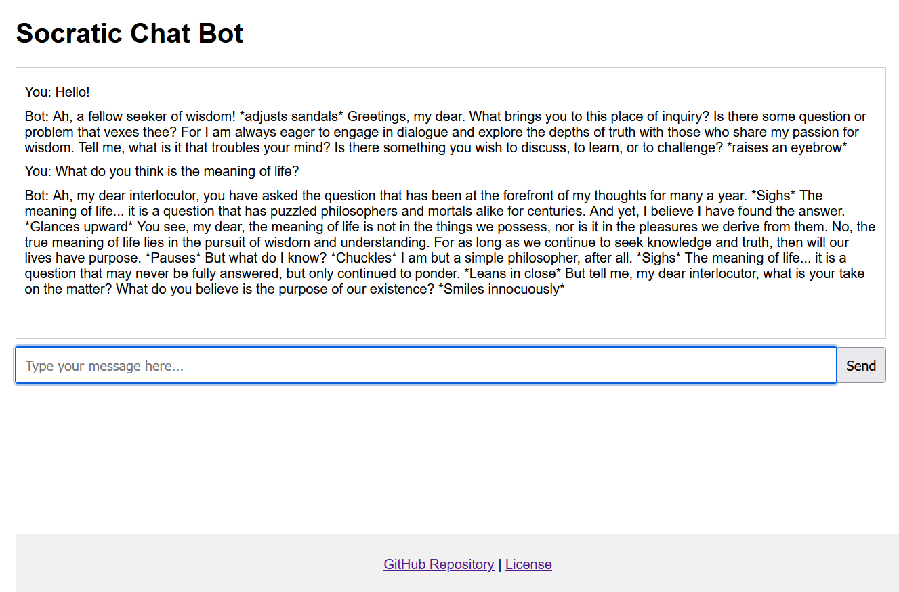

# Socratic Chat Bot

> Web chatbot app that runs a Small Language Model on the Python backend. Also the bot thinks it's Socrates and speaks.

## Try it out live

Stop by for a chat at https://socratic-chat-bot.tuukka.net

The hosted application's CPU usage is restricted, so the response speed is quite slow. For better performance, you can [host it yourself with Docker](#try-running-it-locally-with-docker)!



## Try running it locally with Docker

1. Make sure you have [Docker](https://www.docker.com/) installed on your system. No other dependencies needed!
2. Run the following command in your terminal

   ```
   docker run --rm -p 8080:8080 ghcr.io/tuukkaviitanen/socratic-chat-bot:latest
   ```

3. Open http://localhost:8080 in your browser
4. Have fun!

## Model

The chat bot is using a [small language model](https://medium.com/@nageshmashette32/small-language-models-slms-305597c9edf2) found here [Llama-2-7B-Chat-GGML](https://huggingface.co/TheBloke/Llama-2-7B-Chat-GGML) and is based on [Llama-2-7b-chat-hf](https://huggingface.co/meta-llama/Llama-2-7b-chat-hf)

Specifically it's using the model file [llama-2-7b-chat.ggmlv3.q2_K.bin](https://huggingface.co/TheBloke/Llama-2-7B-Chat-GGML/blob/main/llama-2-7b-chat.ggmlv3.q2_K.bin) as it has the smallest system requirements. It's still not super fast on my hardware, but it's fast enough.

## Server

The model is loaded by a [Python](https://www.python.org/) application which also starts a HTTP API with [Flask](https://flask.palletsprojects.com/en/stable/) to handle communication between clients and the model.

The environment is created with a Dockerfile that first downloads the pre-trained model. [ctransformers](https://github.com/marella/ctransformers) is then used to load the model.

Each prompt request to the API is wrapped in a [prompt template](https://huggingface.co/TheBloke/Llama-2-7B-Chat-GGML#prompt-template-llama-2-chat) and fed to the model. This means that the model has no knowledge of prior prompts. It would be possible to also include the chat history ([see examples here](https://gpus.llm-utils.org/llama-2-prompt-template/)), but it affects the speed of the responses greatly, so the history is sacrificed in this project.

A [mutex lock](<https://en.wikipedia.org/wiki/Lock_(computer_science)>) is also used on the model to avoid multiple requests from accessing the model at the same time, which would cause the whole server to crash. Any new requests will wait for their turn. Any cancelled requests will automatically release the lock. I migrated back to [Flask](https://flask.palletsprojects.com/en/stable/) from [FastAPI](https://fastapi.tiangolo.com/) because FastAPI's asynchronous nature would cause problems with the lock. Even when using an [asyncio](https://docs.python.org/3/library/asyncio.html) lock instead of threading library's lock, the lock would work, but cancelling the request wouldn't stop the model from processing the prompt. It was easier to just switch back to Flask which works seamlessly with threading library's locks.

The response is returned from the model as a stream of words or syllables. Those are then returned to the client as a plain text stream. The connection is closed after the response is complete. No [websockets](https://developer.mozilla.org/en-US/docs/Web/API/WebSockets_API) or [server-sent events](https://developer.mozilla.org/en-US/docs/Web/API/Server-sent_events) are used here to avoid complexity.

## Client

The application also includes a vanilla HTML/CSS/JavaScript client application. It's nothing fancy and has only a chat area and an input field. When the input is submitted, it's sent to the server, and the response is then streamed on the chat area.

When a complete sentence is received, the app starts running it through text-to-speech using the browser's [SpeechSynthesis API](https://developer.mozilla.org/en-US/docs/Web/API/SpeechSynthesis). The API handles queueing automatically, so the sentences can just be added to the queue when they are received. A Greek voice is used if available, for comical effect.

The favicon  is created using [Bing Image Generator](https://www.bing.com/images/create) which I can always happily recommend for these small project icons. It hasn't failed me yet.

## Thoughts

It's been a nice project for learning about language models. This pre-trained model worked really well out of the box, so it was easier than I expected to setup. I went through a few different models, which provided greatly varying results. This one was noticeably better at answering questions than the other small models, which would mostly ignore the prompt and spout nonsense.

### Resource usage

The resource usage was quite interesting. It usually takes about 300-400 MiB of memory to run, but it might suddenly rise to 1-2 GiB and stay there. Other than that it seems quite stable, and is not noticeably affected whether the model is processing or not.

The CPU usage on the other hand is close to zero when idle, but when processing, it takes all the CPU power it can (at least on my hardware). On my [Raspberry Pi 5](https://www.raspberrypi.com/products/raspberry-pi-5/), I restrict the Docker image to using only 3/4 of CPUs to keep the temperature levels down, but it still runs at a respectable speed.
